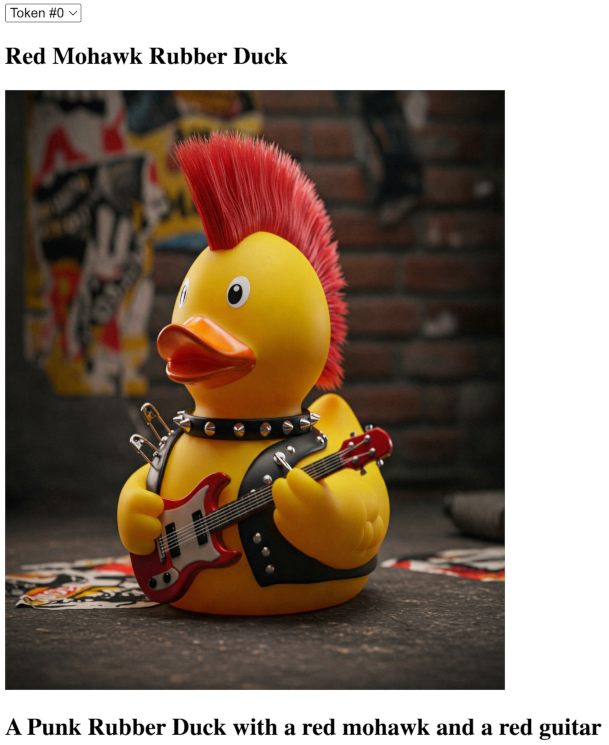

# thirdweb-celo-nft
Create a NFT Drop contract on Thirdweb for Celo Alfajores and display it on a Vite React application

## Instructions

- Create an NFT Drop project on Thirdweb on Celo Alfajores
- Get a Thirdweb Client ID
-  Clone the repository
-  Create a .env file with the following:

```
VITE_CLIENTID = YOURTHIRDWEBCLIENTID
VITE_ADDRESS = YOURCONTRACTADDRESS
```
-  run 
```
npm install
```
- run
```
npm run dev
```


